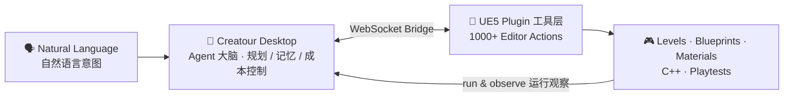

# ZETA Zhou

**让 AI 在虚幻引擎里自主开发游戏** · 工程师 / 创始人

---

## 👋 About Me / 关于我

I build **autonomous AI agents that operate Unreal Engine like a real developer** — they read engine state, write C++ / Blueprint / Lua, run the game, watch what happens, and fix it on their own. I'm the founder and architect of **Creatour**, a stealth-stage AI game development platform exploring how far an agent can carry *real* game production inside UE5.

我构建 **像真实开发者一样操作虚幻引擎的自主 AI Agent** —— 读取引擎状态、编写 C++ / 蓝图 / Lua、运行游戏、观察结果并自我修复。我是 **Creatour** 的创始人与架构师，这是一个仍处隐身阶段的 AI 游戏开发平台，探索 AI Agent 能把虚幻引擎里的*真实*游戏生产推进到多远。

---

## 🛰️ Creatour — AI Game Developer for Unreal Engine &nbsp;`Stealth · 研发中`

> Natural-language intent in, working Unreal Engine content out — levels, Blueprints, materials, C++ gameplay logic, and automated playtesting, all driven by an agent that lives beside the editor.
>
> 输入自然语言意图，产出可运行的虚幻引擎内容 —— 关卡、蓝图、材质、C++ 玩法逻辑与自动化测试，全部由一个驻守在编辑器旁的 Agent 驱动。

**Architecture / 架构** — a desktop **AI brain** paired with an in-engine **tool layer**:

| Capability / 能力 | What it does / 做什么 |
| --- | --- |
| 🤖 **Agent Runtime** | Multi-LLM planning loop with context compression, cost tracking & prompt-cache-aware memory / 多模型规划循环，带上下文压缩、成本追踪与缓存感知记忆 |
| 🔧 **1000+ Editor Actions** | Blueprints, materials, levels, UMG, animation, audio, C++ refactoring — the agent's hands inside UE5 / 蓝图、材质、关卡、UMG、动画、音频、C++ 重构，Agent 在引擎内的双手 |
| 🕸️ **Knowledge Spider Web** | Auto-built project knowledge graph so the agent understands *your* codebase, not just the engine / 自动构建项目知识图谱，让 Agent 理解你的项目而不只是引擎 |
| 🎯 **Auto Playtesting** | Watchdog-driven PIE sessions: the agent plays, watches the screen, and files its own bugs / Watchdog 驱动的 PIE 测试：Agent 自己玩、自己看画面、自己报 bug |
| 📈 **Perf Analysis** | Automated profiling with machine-readable reports for AI-driven optimization / 自动化性能剖析，输出机器可读报告驱动 AI 优化 |

*More to share soon — feel free to reach out. / 更多细节即将公开，欢迎联系。*

---

## 🧭 What I Focus On / 工作方向

- 🤖 **AI Agents for UE / 引擎内 AI Agent** — perceive → act → verify loops running inside the editor
- 🧠 **Agent Runtime Engineering / Agent 运行时工程** — context management, prompt caching economics, tool-call orchestration at scale
- 🧩 **Editor Tooling / 编辑器工具链** — custom UE5 plugins that streamline content creation & QA
- ⚙️ **Pipeline Automation / 流程自动化** — Python & C++ to remove repetitive engine work
- 📈 **Performance Analysis / 性能分析** — automated profiling that exports machine-readable reports for AI-driven optimization

---

## 🧰 Tech Stack / 技术栈

  
  
  
  
  
  
  
  
  
  

---

## 📫 Connect / 联系

  

Building the bridge between Unreal Engine and autonomous AI development. / 在虚幻引擎与自主 AI 开发之间架桥。

